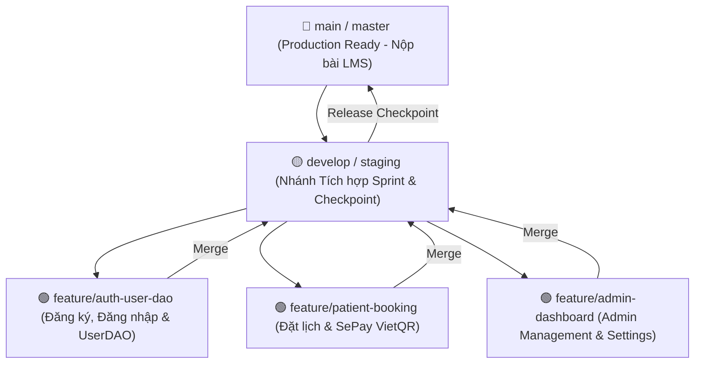

# 🎯 HƯỚNG DẪN QUẢN LÝ DỰ ÁN AGILE & THÓI QUEN KỸ THUẬT CHUẨN SENIOR (PRJ301)

Document này hướng dẫn bạn quy trình làm việc chuẩn công nghiệp (Industry Standard Workflow) giúp bạn luyện tập kỹ năng **Project Management (Scrum/Agile)** và rèn luyện **Thói quen Code Sạch (Clean Code Habits)** trong suốt quá trình phát triển dự án `PRJ301_Clinic`.

---

## 🚀 5 THÓI QUEN VÀNG KHI CODE DỰ ÁN

### 1. 📌 Thói quen 1: Task-Driven Development (Quản lý Tiến độ theo Task nhỏ)
- **Quy tắc**: Đừng nhìn vào một bức tranh quá lớn làm bị ngợp! Hãy chia nhỏ một tính năng thành các Task bé kéo dài từ **15 đến 45 phút**.
- **Ví dụ**: Tính năng *Đăng nhập (Login)* được chia nhỏ thành:
  - [ ] `Task 1.1`: Tạo `User.java` Model POJO.
  - [ ] `Task 1.2`: Viết `UserDAO.login(username, password)` truy vấn SQL.
  - [ ] `Task 1.3`: Viết Unit Test `UserDAOTest.java` bằng JUnit 5.
  - [ ] `Task 1.4`: Tạo `AuthServlet.java` xử lý POST `/login`.
  - [ ] `Task 1.5`: Thiết kế `login.jsp` với Bootstrap 5 & JS Validation.

---

### 2. 🌿 Thói quen 2: Conventional Git Commits (Lịch sử Commit Sạch đẹp)
- **Quy tắc**: Mỗi khi hoàn thành xong 1 Task nhỏ chạy thông suốt, thực hiện `git commit` ngay lập tức!
- **Cú pháp chuẩn Conventional Commits**:
  - `feat:` Thêm tính năng mới (VD: `feat: add UserDAO login method with prepared statement`).
  - `fix:` Sửa lỗi (VD: `fix: correct password hash verification in BCryptUtil`).
  - `test:` Thêm hoặc sửa Unit Test (VD: `test: add JUnit 5 test for UserDAO authentication`).
  - `docs:` Cập nhật tài liệu (VD: `docs: update SRS proposal with Agile methodology`).
  - `refactor:` Tối ưu code mà không thay đổi chức năng.

---

### 3. 🧪 Thói quen 3: Immediate Verification (Code đến đâu, Test ngay đến đó)
- **Quy tắc**: **KHÔNG BAO GIỜ** viết 5-10 file Java một lúc rồi mới khởi động Server Tomcat!
- **Quy trình đúng**:
  1. Viết hàm DAO $\rightarrow$ Chạy **JUnit 5 Test Case** kiểm tra dữ liệu thật trong SQL Server.
  2. Test DAO xanh (PASSED) $\rightarrow$ Mới chuyển sang viết Servlet Controller.
  3. Bật Postman / Browser test Servlet $\rightarrow$ Mới chuyển sang vẽ giao diện JSP.

---

### 4. 🧼 Thói quen 4: Single Responsibility & Layered Separation (Đúng Vai Đúng Việc)
- **DAO Layer (`dao/`)**: Chỉ chứa câu lệnh SQL (`SELECT`, `INSERT`, `UPDATE`, `DELETE`). KHÔNG dính dáng đến `HttpServletRequest` hay HTTP Session!
- **Model Layer (`model/`)**: Chỉ chứa thuộc tính (fields), Getters, Setters, Constructors và `toString()`. KHÔNG chứa SQL!
- **Servlet Layer (`controller/`)**: Chỉ tiếp nhận `request.getParameter()`, validate sơ bộ, gọi Service/DAO và điều hướng `request.getRequestDispatcher().forward()`.
- **View Layer (`web/WEB-INF/views/`)**: Chỉ chứa JSP + JSTL + HTML/CSS để hiển thị dữ liệu. KHÔNG viết Java Scriptlet `<% ... %>` trong JSP!

---

### 5. 🛡️ Thói quen 5: Defensive Programming (Lập trình Phòng thủ & Quản lý Tài nguyên)
- **Giải phóng Resource CSDL**: Luôn bọc `Connection`, `PreparedStatement`, `ResultSet` trong cú pháp `try-with-resources` để tự động đóng kết nối, tránh tràn Memory / Connection Leak trong HikariCP:
  ```java
  String sql = "SELECT * FROM Users WHERE username = ?";
  try (Connection conn = DBContext.getConnection();
       PreparedStatement ps = conn.prepareStatement(sql)) {
      ps.setString(1, username);
      try (ResultSet rs = ps.executeQuery()) {
          if (rs.next()) {
              // Read data...
          }
      }
  } catch (SQLException e) {
      LOGGER.error("Error executing query", e);
  }
  ```

---

### 6. 🌿 Thói quen 6: Mô hình Chia nhánh Git Chuyên nghiệp (Enterprise Git Flow Strategy)
Trong môi trường doanh nghiệp chuẩn công nghiệp, cây nhánh Git được phân tách thành **4 tầng nhánh nghiêm ngặt**:



- **Quy tắc Đặt tên Nhánh chuẩn Quốc tế**:
  - 🔴 `main`: Nhánh sản phẩm hoàn chỉnh 100% dùng nộp LMS và bảo vệ vấn đáp. Tuyệt đối không commit rác vào `main`.
  - 🟡 `develop`: Nhánh tích hợp dữ liệu chính của Sprint, dùng demo tại các mốc **Checkpoint 1** (17/08) và **Checkpoint 2** (22/08).
  - 🟢 `feature/<phân-hệ-chức-năng>`: Nhánh phát triển riêng cho từng module:
    - `feature/auth-user-dao`: Module Đăng ký/Đăng nhập & UserDAO.
    - `feature/patient-booking`: Module Bệnh nhân Đặt lịch & AJAX Slots.
    - `feature/sepay-payment`: Module Thanh toán SePay VietQR & Webhook.
    - `feature/doctor-medical-record`: Module Bác sĩ cập nhật Bệnh án.
    - `feature/admin-management`: Module Admin Dashboard & Cấu hình Động.
  - 🔴 `hotfix/<tên-lỗi>`: Nhánh sửa lỗi khẩn cấp khi demo (VD: `hotfix/fix-hikari-timeout`).

---

### 7. ⚡ Thói quen 7: Immediate Atomic Commit (Hoàn thành đâu, Commit ngay đó)
- **Quy tắc**: **KHÔNG GOM CODE CẢ NGÀY MỚI COMMIT 1 LẦN**. Ngay khi hoàn thành 1 file hoặc 1 hàm nhỏ chạy thông suốt:
  1. Chạy `git status` để kiểm tra file thay đổi.
  2. Chạy `git add <file>` để stage đúng file vừa sửa.
  3. Chạy `git commit -m "feat: <mô-tả-ngắn>"` ngay lập tức!

---

### 8. ⏱️ Thói quen 8: Pragmatic Delivery & Feature-First Strategy (Chiến lược Ưu tiên Sát Deadline)
- **Quy tắc Vàng**: **"TÍNH NĂNG CHẠY THỰC TẾ LÀ ƯU TIÊN SỐ 1"**. Khi chịu áp lực Deadline:
  1. **Ưu tiên 1 (85% Điểm số)**: Viết trực tiếp lớp Class DAO (`UserDAO.java`), dồn sức cho tính năng thực tế chạy 100% không bug (Đăng ký, Đăng nhập, Đặt lịch, SePay VietQR).
  2. **Ưu tiên 2 (15% Điểm số)**: Tách Interface (`IUserDAO`) sau nếu còn dư thời gian trước hạn nộp (chỉ tốn 5 phút dùng tính năng Refactor `Extract Interface` trên IDE).
  3. **Tuyên ngôn**: Đồ án PRJ301 ăn điểm cao nhất nhờ tính năng chạy ổn định, giao diện mượt mà và không văng lỗi Runtime.

---

## 📅 SPRINT BOARD TIẾN ĐỘ DỰ ÁN (AGILE SPRINT ROADMAP)

### 🔴 SPRINT 1: CƠ SỞ DỮ LIỆU & BỘ KHUNG (ĐẠT CHECKPOINT 1 - 17/08)
- [x] `Task 1`: Khởi tạo CSDL SQL Server `PRJ301_ClinicDB` (7 Bảng + Mock Data + 4 Triggers/Procedures).
- [x] `Task 2`: Chuẩn hóa 8 Packages Java (`config`, `constant`, `model`, `dao`, `service`, `controller`, `filter`, `exception`, `util`).
- [x] `Task 3`: Cài đặt 14 thư viện JAR Java 8 (`mssql-jdbc`, `HikariCP`, `jbcrypt`, `jackson`, `jstl`, `junit5`).
- [x] `Task 4`: Tạo 7 POJO Models, `DBContext.java` và utilities (`BCryptUtil`, `ValidationUtil`).
- [x] `Task 5`: Tạo Git Repository gốc, `.gitignore`, `.gitkeep` và file `README.md` ấn tượng.

### 🟡 SPRINT 2: CORE LOGIC, SEPAY & TESTING (ĐẠT CHECKPOINT 2 & FINAL - 22/08)
- [ ] `Task 6 (DAO Layer)`: Hoàn thiện 7 lớp DAO (`UserDAO`, `ServiceDAO`, `DoctorProfileDAO`, `DoctorScheduleDAO`, `AppointmentDAO`, `MedicalRecordDAO`, `ClinicSettingDAO`).
- [ ] `Task 7 (Security Filters)`: Hoàn thiện `EncodingFilter` (UTF-8), `AuthenticationFilter` (Session check), `AuthorizationFilter` (Role 430 Access Denied).
- [ ] `Task 8 (Auth & Patient Module)`: Servlets & JSPs Đăng ký, Đăng nhập, Đặt lịch hẹn (AJAX Slot 60m), Thanh toán SePay VietQR (Auto Polling 3s).
- [ ] `Task 9 (Doctor & Admin Module)`: Dashboard Bác sĩ (Cập nhật bệnh án) & Dashboard Admin (Thống kê doanh thu, Duyệt tay Manual Verify, Manage Settings).
- [ ] `Task 10 (Testing & Submission)`: Chạy bộ kiểm thử JUnit 5, Postman test Webhook, quay Video Demo và nộp LMS / Bảo vệ Vấn đáp.
