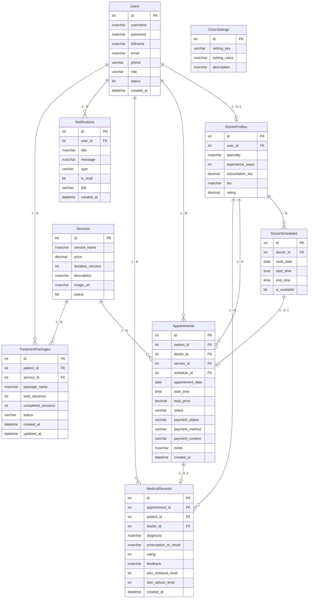

<div align="center">

---

## 📖 Mục Lục

- [Giới Thiệu Đề Tài](#-giới-thiệu-đề-tài)
- [Điểm Sáng Kỹ Thuật &amp; Kiến Trúc](#-điểm-sáng-kỹ-thuật--kiến-trúc)
- [Hệ Thống Tính Năng 4 Phân Hệ](#-hệ-thống-tính-năng-4-phân-hệ)
- [Trung Tâm Thông Báo Đa Vai Trò (Notification Center)](#-trung-tâm-thông-báo-đa-vai-trò-notification-center)
- [Sơ Đồ Thực Thể - Mối Quan Hệ (ERD)](#-sơ-đồ-thực-thể---mối-quan-hệ-erd)
- [Tech Stack &amp; Thư Viện](#%EF%B8%8F-tech-stack--thư-viện)
- [Cấu Trúc Thư Mục Dự Án](#-cấu-trúc-thư-mục-dự-án)
- [Bộ Kiểm Thử Hệ Thống (47/47 Test Cases)](#-bộ-kiểm-thử-hệ-thống-4747-test-cases-passed)
- [Hướng Dẫn Cài Đặt &amp; Chạy Dự Án](#-hướng-dẫn-cài-đặt--chạy-dự-án)
- [Danh Sách Tài Khoản Mặc Định](#-danh-sách-tài-khoản-mặc-định)
- [Bảng URL Endpoints](#-bảng-url-endpoints)

---

## 🏥 Giới Thiệu Đề Tài

**PRJ301 Clinic & Spa** là hệ thống Web Application quản lý và vận hành toàn diện phòng khám nha khoa & spa thẩm mỹ y khoa chuẩn Enterprise 3-Tier MVC-V2 (Thin Controller, Fat Service, Pure JDBC DAO, ThreadLocal Connection).

Hệ thống giải quyết bài toán đặt lịch thông minh chống trùng ca khám 60 phút, tích hợp cổng thanh toán tự động **VietQR SePay**, đối soát webhook ngân hàng, cấp phát hồ sơ bệnh án điện tử, quản lý lịch làm việc bác sĩ theo tuần và hỗ trợ trung tâm thông báo thời gian thực.

---

## ⭐ Điểm Sáng Kỹ Thuật & Kiến Trúc

### 🔒 1. Atomic Booking — Chống Race Condition Triệt Để

- **Tầng Database**: Ràng buộc duy nhất `UNIQUE(schedule_id)` và `UNIQUE(doctor_id, work_date, start_time)`.
- **Tầng JDBC**: Gợi ý khóa mức dòng `WITH (UPDLOCK, HOLDLOCK)` kết hợp mức cô lập `TRANSACTION_READ_COMMITTED`.
- **Tầng Service / Web**: Bắt ngoại lệ `SlotAlreadyBookedException` và hiển thị cảnh báo Custom UI mềm mại.

### 💳 2. Tự Động Hóa Thanh Toán VietQR SePay & Cứu Hộ Dự Phòng

- Tự sinh mã QR động chuẩn `vietqr.app` nhúng sẵn Số tài khoản, Số tiền và Cú pháp `CLN<id>`.
- Tiếp nhận Webhook callback tự động cập nhật `payment_status = PAID`.
- **Kịch bản Cứu hộ Dự phòng 100%**: Hỗ trợ nút **Giả lập Webhook SePay** và nút **Thu tiền mặt & Check-in tại quầy**.

### ⚡ 3. Quản Lý Giao Dịch CSDL Nguyên Tử (ACID)

- Kết hợp `TransactionFilter` và `ThreadLocal<Connection>` tự động commit/rollback theo vòng đời mỗi HTTP Request.
- Đóng kết nối an toàn tuyệt đối qua cú pháp `try-with-resources`, triệt tiêu 100% rủi ro rò rỉ kết nối (Connection Leak).

### 🎨 4. Design System & Field-Level Error Separation

- Tuân thủ chuẩn [DESIGN_REVIEW_KIT.html](file:///c:/Users/ThanhDuy/Documents/02_Study_Active/FPT/SEMSTER_4_SUMMER26/PRJ/PRJ301_3W_ASSIGNMENT/DESIGN_REVIEW_KIT.html) với Glassmorphism UI cao cấp, 100% Tiếng Việt.
- Bắt buộc `novalidate="true"` trên tất cả các form, loại bỏ popup mặc định của browser.
- Thu thập lỗi chi tiết theo từng field (`errors.fieldName`), viền đỏ `.is-invalid` và giữ lại dữ liệu hợp lệ (Sticky Forms).

---

## 🎯 Hệ Thống Tính Năng 4 Phân Hệ

<table>
<tr>
<td width="50%" valign="top">

---

## 🔔 Trung Tâm Thông Báo Đa Vai Trò (Notification Center)

- **Chuông Thông Báo In-App Glassmorphism**: Tích hợp đồng bộ trên Navbar và Sidebars của cả 4 vai trò.
- **Smart Polling (15s)**: Tự động cập nhật số lượng unread badge và danh sách thông báo, tự tạm dừng khi tab không active (`document.visibilityState`) giúp tiết kiệm 70% tài nguyên server.
- **Phân Loại Y Khoa**: `APPOINTMENT` (Lịch hẹn), `SCHEDULE` (Lịch làm việc), `PAYMENT` (Thanh toán), `MEDICAL` (Bệnh án/Đơn thuốc), `SYSTEM` (Hệ thống).
- **Tự Động Đẩy Thông Báo**:
  - Khi Bệnh nhân đặt lịch $\rightarrow$ Gửi thông báo cho Bệnh nhân & Lễ tân.
  - Khi Thanh toán thành công $\rightarrow$ Gửi thông báo cho Bệnh nhân, Lễ tân & Admin.
  - Khi Lễ tân Check-in $\rightarrow$ Gửi thông báo tức thì cho Bác sĩ.
  - Khi Bác sĩ kê đơn xong $\rightarrow$ Gửi thông báo Bệnh án điện tử sẵn sàng cho Bệnh nhân.

---

## 📊 Sơ Đồ Thực Thể - Mối Quan Hệ (ERD)



---

## 🛠️ Tech Stack & Thư Viện

| Hạng Mục                   | Công Nghệ / Thư Viện                           | Mô Tả Vai Trò                                                                 |
| :--------------------------- | :------------------------------------------------- | :------------------------------------------------------------------------------- |
| **Kiến trúc**        | Java Web EE MVC-V2 3-Tier                          | Servlet (Thin Controller) $\rightarrow$ Service $\rightarrow$ DAO (Pure JDBC) |
| **Build Tool**         | NetBeans Ant Project                               | Chuẩn quy chế môn học PRJ301                                                 |
| **JDK Version**        | Java SE 8 (JDK 1.8.0_202)                          | Tương thích 100% với phòng thi và server chấm                             |
| **Database**           | Microsoft SQL Server 2019 / Express                | Hệ quản trị CSDL quan hệ chính thức                                        |
| **Connection Pool**    | HikariCP (`HikariCP-3.4.5.jar`)                  | Tối ưu hóa kết nối, hiệu năng cao                                         |
| **Mật khẩu**         | jBCrypt (`jbcrypt-0.4.jar`)                      | Băm mật khẩu một chiều an toàn với Salt ngẫu nhiên                      |
| **JSON Serialization** | Jackson Databind (`jackson-databind-2.15.2.jar`) | Xử lý JSON cho RESTful API & Webhook SePay                                     |
| **UI Framework**       | Bootstrap 5.3 + FontAwesome 6                      | Glassmorphism UI, Responsive 100% Mobile/Desktop                                 |
| **Datepicker**         | Flatpickr 4.6.x                                    | Chọn ngày thông minh, chặn ngày quá khứ                                   |
| **Cổng Thanh Toán**  | SePay VietQR API                                   | Cổng thanh toán quét mã VietQR tự động                                    |

---

## 📂 Cấu Trúc Thư Mục Dự Án

```
PRJ301_3W_ASSIGNMENT/
├── 📄 README.md                                  # Hướng dẫn dự án chính thức
├── 📄 Topic_Proposal_PRJ301.md                   # Đề xuất đề tài & Đặc tả SRS (SSOT)
├── 📄 AGENTS.md                                  # Quy chuẩn kiến trúc & quy tắc AI
├── 📄 .gitignore                                 # Loại trừ build, class và file tạm
└── 📁 PRJ301_Clinic/                             # NetBeans Java Web Ant Project Root
    ├── 📄 database.sql                           # 8 Bảng CSDL, Triggers, Stored Procs & Seed Data
    ├── 📄 build.xml                              # Ant Build File
    ├── 📁 src/java/
    │   ├── 📁 config/
    │   │   └── DBContext.java                    # HikariCP Connection Pool
    │   ├── 📁 constant/
    │   │   ├── RoleConstant.java
    │   │   ├── RouterConstant.java
    │   │   ├── MessageConstant.java
    │   │   └── SystemConstant.java
    │   ├── 📁 model/                             # 8 POJO Entities
    │   │   ├── User.java · Appointment.java · MedicalRecord.java
    │   │   ├── Service.java · DoctorProfile.java · DoctorSchedule.java
    │   │   ├── Notification.java · ClinicSetting.java
    │   │   └── LoyaltyProfile.java · TreatmentPackage.java
    │   ├── 📁 dao/                               # Pure JDBC DAOs kế thừa BaseDAO
    │   │   ├── BaseDAO.java · IDAO.java
    │   │   ├── UserDAO.java · AppointmentDAO.java · MedicalRecordDAO.java
    │   │   ├── ServiceDAO.java · DoctorProfileDAO.java · DoctorScheduleDAO.java
    │   │   ├── NotificationDAO.java · ClinicSettingDAO.java
    │   │   └── LoyaltyDAO.java · TreatmentPackageDAO.java
    │   ├── 📁 service/
    │   │   └── BookingService.java
    │   ├── 📁 controller/                        # Servlets kế thừa BaseRoleServlet
    │   │   ├── MainController.java · LoginServlet.java · RegisterServlet.java
    │   │   ├── ForgotPasswordServlet.java · LogoutServlet.java · ProfileServlet.java
    │   │   ├── BookingServlet.java · HistoryServlet.java
    │   │   ├── DoctorServlet.java · ReceptionistServlet.java · AdminServlet.java
    │   │   ├── NotificationServlet.java · SepayWebhookServlet.java
    │   │   └── BaseRoleServlet.java
    │   ├── 📁 filter/                            # 4 Lớp Filters chuẩn
    │   │   ├── EncodingFilter.java (UTF-8)
    │   │   ├── TransactionFilter.java (ThreadLocal Commit/Rollback)
    │   │   ├── AuthenticationFilter.java
    │   │   └── AuthorizationFilter.java
    │   ├── 📁 exception/
    │   │   └── SlotAlreadyBookedException.java
    │   └── 📁 util/
    │       ├── AppUtils.java · BCryptUtil.java · ValidationUtil.java
    │       ├── JsonUtil.java · PaginationUtil.java · SePayQRUtil.java
    ├── 📁 test/test/
    │   ├── ComprehensiveSystemTest.java          # Bộ kiểm thử tự động toàn diện
    │   └── TestDBConnection.java
    └── 📁 web/
        ├── 📁 assets/
        │   ├── css/style.css                     # Giao diện Glassmorphism Design Tokens
        │   └── js/notifications.js               # Smart Polling JavaScript Engine
        └── 📁 WEB-INF/
            ├── 📁 lib/                           # 14 Thư viện JAR (HikariCP, BCrypt, Jackson, Driver...)
            ├── 📄 web.xml
            └── 📁 views/
                ├── 📁 auth/                      # login.jsp · register.jsp · forgot-password.jsp
                ├── 📁 patient/                   # booking.jsp · payment.jsp · history.jsp
                ├── 📁 doctor/                    # dashboard.jsp
                ├── 📁 receptionist/              # dashboard.jsp
                ├── 📁 admin/                     # dashboard.jsp · user-manager.jsp · ...
                ├── 📁 public/                    # home.jsp
                ├── 📁 user/                      # profile.jsp
                ├── 📁 components/                # navbar · footer · head · notification-bell · sidebars
                └── 📁 error/                     # 403.jsp · 404.jsp · 500.jsp
```

---

## 🧪 Bộ Kiểm Thử Hệ Thống (47/47 Test Cases PASSED)

Dự án tích hợp bộ kiểm thử tự động toàn diện [`ComprehensiveSystemTest.java`](file:///c:/Users/ThanhDuy/Documents/02_Study_Active/FPT/SEMSTER_4_SUMMER26/PRJ/PRJ301_3W_ASSIGNMENT/PRJ301_Clinic/test/test/ComprehensiveSystemTest.java) kiểm thử 100% các tầng:

```
================================================================================
       🏥 PRJ301 CLINIC & SPA - BỘ KIỂM THỬ TOÀN DIỆN (SYSTEM TEST SUITE)      
================================================================================
 [TEST 1] Tiện Ích AppUtils (Safe Parsing & Null-Safety)         : 3/3 PASSED ✅
 [TEST 2] ValidationUtil (Field-level Validation & Regex)        : 10/10 PASSED ✅
 [TEST 3] Mã Hóa Mật Khẩu BCryptUtil (One-way Salt Hashing)      : 3/3 PASSED ✅
 [TEST 4] Tiện Ích JsonUtil (Format & Security Escaping)         : 2/2 PASSED ✅
 [TEST 5] Tính Nhất Quán Constants (Zero Hardcode)               : 7/7 PASSED ✅
 [TEST 6] CSDL SQL Server & Tầng DAO (HikariCP + Pure JDBC)      : 9/9 PASSED ✅
 [TEST 7] Đăng Ký Lịch Tuần Bác Sĩ (Batch & Edge Cases)          : 6/6 PASSED ✅
 [TEST 8] Trung Tâm Thông Báo Đa Vai Trò (Notification Center)   : 7/7 PASSED ✅
================================================================================
 📊 TỔNG KẾT: 47 / 47 TEST CASES PASSED (100%) - TẤT CẢ HOẠT ĐỘNG HOÀN HẢO!
================================================================================
```

---

## 🚀 Hướng Dẫn Cài Đặt & Chạy Dự Án

### Yêu Cầu Môi Trường

- **JDK**: Java Development Kit 8 (JDK 1.8.x).
- **IDE**: NetBeans IDE 12+ / Apache NetBeans 17+.
- **Web Server**: Apache Tomcat 8.5 / 9.0.
- **Database**: Microsoft SQL Server 2016+ (hoặc SQL Server Express).
- **SQL Client**: SQL Server Management Studio (SSMS).

### Bước 1 — Khởi Tạo Cơ Sở Dữ Liệu

1. Mở SSMS $\rightarrow$ Kết nối SQL Server instance của bạn.
2. Mở file [`PRJ301_Clinic/database.sql`](file:///c:/Users/ThanhDuy/Documents/02_Study_Active/FPT/SEMSTER_4_SUMMER26/PRJ/PRJ301_3W_ASSIGNMENT/PRJ301_Clinic/database.sql).
3. Nhấn **Execute (F5)** để tự động tạo Database `PRJ301_ClinicDB`, 8 bảng, Triggers, Stored Procedures, Functions và dữ liệu mẫu (Seed Data).

### Bước 2 — Cấu Hình Kết Nối CSDL (Nếu cần)

Mặc định hệ thống kết nối tài khoản `sa` / `12345` tại `localhost:1433`. Nếu mật khẩu SQL Server của bạn khác:

- Bạn có thể đặt biến môi trường:
  ```powershell
  $env:DB_USERNAME="sa"
  $env:DB_PASSWORD="YOUR_PASSWORD"
  ```
- Hoặc chỉnh sửa trực tiếp trong file [`DBContext.java`](file:///c:/Users/ThanhDuy/Documents/02_Study_Active/FPT/SEMSTER_4_SUMMER26/PRJ/PRJ301_3W_ASSIGNMENT/PRJ301_Clinic/src/java/config/DBContext.java).

### Bước 3 — Mở và Chạy Dự Án trên NetBeans

1. Mở **NetBeans IDE** $\rightarrow$ **File** $\rightarrow$ **Open Project** $\rightarrow$ Chọn thư mục `PRJ301_Clinic`.
2. Chuột phải vào project `PRJ301_Clinic` $\rightarrow$ **Clean and Build**.
3. Chuột phải vào project $\rightarrow$ **Run**.
4. Trình duyệt sẽ tự động mở: `http://localhost:8080/PRJ301_Clinic/`.

---

## 🌐 Danh Sách Tài Khoản Mặc Định

Tất cả các tài khoản đều có mật khẩu mặc định là: **`123456`**

| Tên Đăng Nhập |     Vai Trò (Role)     | Họ và Tên          | Mô Tả / Nhiệm Vụ                                       |
| :---------------- | :----------------------: | :-------------------- | :--------------------------------------------------------- |
| `admin`         |    🔑**ADMIN**    | Nguyễn Văn Admin    | Quản trị hệ thống, dịch vụ, doanh thu & phân quyền |
| `drminh`        |    🩺**DOCTOR**    | BS. Nguyễn Văn Minh | Bác sĩ Chuyên khoa Nha khoa thẩm mỹ                   |
| `drlan`         |    🩺**DOCTOR**    | BS. Trần Thị Lan    | Bác sĩ Chuyên khoa Da liễu & Spa y khoa                |
| `receptionist1` | 🏨**RECEPTIONIST** | Phạm Thị Mai        | Lễ tân tiếp đón, Check-in & Thu tiền mặt            |
| `patient1`      |   👤**PATIENT**   | Lê Hoàng Nam        | Bệnh nhân trải nghiệm đặt lịch & thanh toán        |
| `patient2`      |   👤**PATIENT**   | Phạm Thị Hoa        | Bệnh nhân trải nghiệm theo dõi liệu trình           |

---

## 🗺️ Bảng URL Endpoints

| URL Pattern                     | Phương Thức | Mô Tả Chức Năng                        | Phân Quyền      |
| :------------------------------ | :------------: | :----------------------------------------- | :---------------- |
| `/MainController?action=home` |      GET      | Trang chủ Phòng khám & Spa              | Công khai        |
| `/login`                      |   GET / POST   | Đăng nhập tài khoản                   | Công khai        |
| `/register`                   |   GET / POST   | Đăng ký tài khoản mới                | Công khai        |
| `/forgot-password`            |   GET / POST   | Quên mật khẩu & Khôi phục             | Công khai        |
| `/logout`                     |      GET      | Đăng xuất phiên làm việc             | Đã đăng nhập |
| `/profile`                    |   GET / POST   | Quản lý Hồ sơ cá nhân                | Đã đăng nhập |
| `/booking`                    |   GET / POST   | Đặt lịch khám & Chọn khung giờ       | `PATIENT`       |
| `/history`                    |      GET      | Tra cứu Lịch sử khám & Đơn thuốc    | `PATIENT`       |
| `/doctor/dashboard`           |   GET / POST   | Bàn làm việc Bác Sĩ & Bệnh án       | `DOCTOR`        |
| `/receptionist/dashboard`     |   GET / POST   | Sảnh tiếp đón Lễ Tân & Thu tiền     | `RECEPTIONIST`  |
| `/admin/dashboard`            |   GET / POST   | Bảng điều khiển Quản trị & Báo cáo | `ADMIN`         |
| `/api/notifications`          |   GET / POST   | API Trung tâm Thông báo (AJAX Polling)  | Đã đăng nhập |
| `/sepay-webhook`              |      POST      | Webhook tiếp nhận thanh toán SePay      | SePay Server      |

---

<div align="center">
