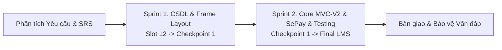
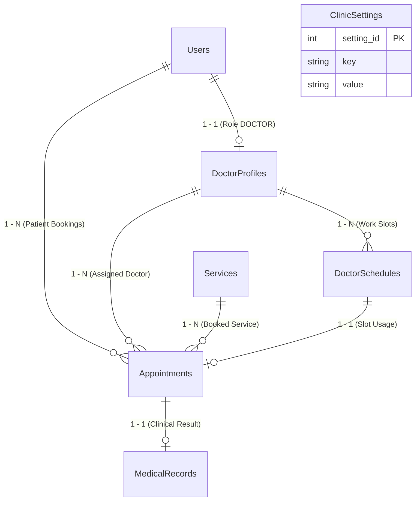
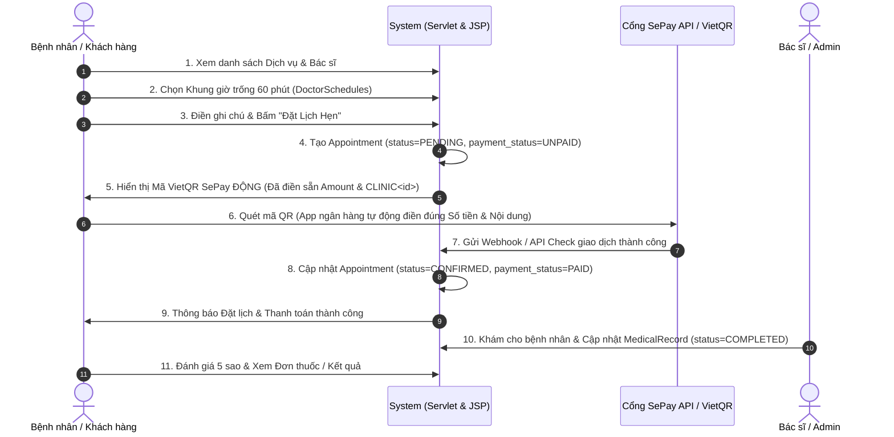
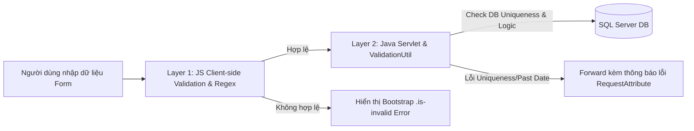
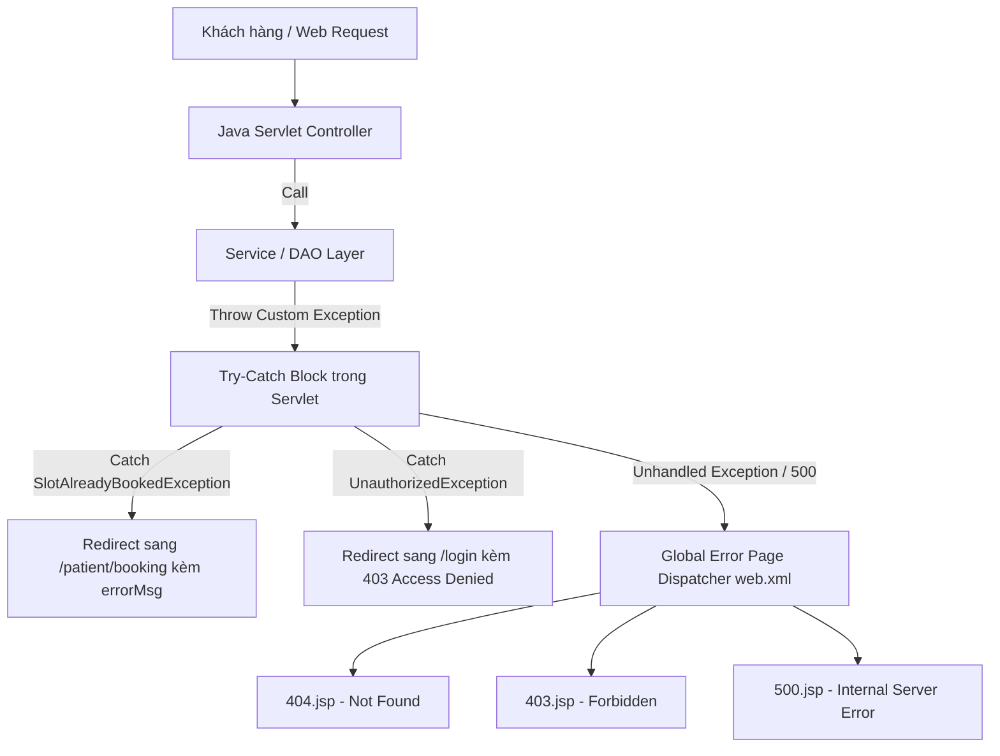
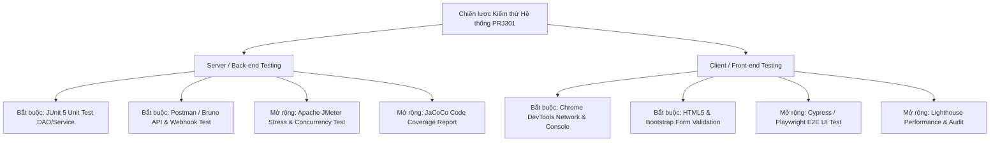

# BẢN ĐỀ XUẤT ĐỀ TÀI & THIẾT KẾ HỆ THỐNG (TOPIC PROPOSAL & SRS)

**Môn học**: PRJ301 – Java Web Application Development **Hình thức**: Bài tập cá nhân (Individual Assignment) **Tên đề tài**: **Hệ thống Đặt lịch Phòng khám & Spa trực tuyến tích hợp Thanh toán QR SePay (PRJ301_ClinicDB)** **Loại dự án**: NetBeans Java Web (Ant Build Project) **Hệ quản trị CSDL**: Microsoft SQL Server **Kiến trúc hệ thống**: Java Web EE MVC-V2 (Pure JDBC, Servlet, JSP, EL, JSTL, Bootstrap 5) **Tác giả**: Nguyễn Thanh Duy - SE2031514

---

## I. GIỚI THIỆU & LÝ DO CHỌN ĐỀ TÀI

### 1. Lý do chọn đề tài

Trong thời đại công nghệ số, việc đăng ký và quản lý lịch hẹn khám chữa bệnh hoặc dịch vụ chăm sóc sắc đẹp trực tiếp tại phòng khám/spa gây ra nhiều hạn chế như: xếp hàng chờ đợi lâu, trùng lịch bác sĩ, khó theo dõi hồ sơ bệnh án và lịch sử dịch vụ.

**Hệ thống Đặt lịch Phòng khám & Spa (PRJ301_ClinicDB)** được xây dựng nhằm giải quyết triệt để các vấn đề trên, cung cấp giải pháp đặt lịch thông minh với khung giờ 60 phút cố định, tích hợp thanh toán tự động qua **Cổng thanh toán SePay VietQR**, tối ưu hóa lịch làm việc cho bác sĩ/chuyên gia và mang lại công cụ quản trị toàn diện cho ban quản lý.

### 2. Mục tiêu hệ thống

- **Đối với Khách hàng / Bệnh nhân**: Tìm kiếm dịch vụ, lựa chọn bác sĩ theo chuyên khoa, đặt lịch hẹn theo khung giờ rảnh 60 phút, quét mã QR thanh toán SePay tự động (tự động khóa số tiền & nội dung chuyển khoản) và tra cứu hồ sơ kết quả/bệnh án trực tuyến.
- **Đối với Bác sĩ / Kỹ thuật viên (Mô hình Hybrid)**: Tự đăng ký khung giờ rảnh cá nhân hoặc nhận lịch phân công từ Admin, theo dõi danh sách lịch hẹn trong ngày/tuần, cập nhật chẩn đoán, kê đơn/kết quả dịch vụ và xem đánh giá từ khách hàng.
- **Đối với Quản trị viên (Admin)**: Toàn quyền quản trị 7 bảng (bao gồm quản lý Cấu hình hệ thống `ClinicSettings`), chủ động phân lịch cho bác sĩ, kiểm duyệt lịch hẹn, quản lý giá cả dịch vụ và xem thống kê báo cáo doanh thu.

---

### 3. Mô hình Phát triển Phần mềm (Software Development Methodology)

Dựa trên quy mô bài tập cá nhân, giới hạn thời gian ngắn (2-3 tuần) và yêu cầu đánh giá theo từng mốc Checkpoint môn học, dự án áp dụng **Mô hình Agile/Scrum Rút gọn (Lightweight Agile - Incremental SDLC Model)** với 2 Sprints cốt lõi:



- **Rationale (Lý do chọn Agile/Incremental)**:
  - **Tương thích 100% với các mốc Đánh giá (Milestone Alignment)**: Chia nhỏ khối lượng công việc theo 2 Sprint song song với mốc Checkpoint 1 (17/08) và Checkpoint 2/Final (22/08) của giảng viên.
  - **Kiểm thử Liên tục (Early & Frequent Testing)**: Mỗi module hoàn thành (CSDL $\rightarrow$ DAO $\rightarrow$ Servlet $\rightarrow$ JSP) đều được chạy Unit Test với JUnit 5 và Postman ngay lập tức, triệt tiêu nguy cơ dồn lỗi vào cuối kỳ như mô hình Thác nước (Waterfall).
  - **Quản lý Rủi ro Đồ án (Risk Management)**: Thiết lập sẵn các kịch bản dự phòng (Fallback Strategy: Nút Giả lập Webhook & Nút Tiền mặt) ngay từ Sprint 2 để đảm bảo buổi bảo vệ thành công tuyệt đối.

---

## II. BẢNG CHI TIẾT TECH STACK & QUY ĐỊNH KỸ THUẬT (HARD RULES)

### 1. Danh mục Công nghệ & Thư viện (Đã chốt 100%)

| Hạng mục | Công nghệ / Thư viện đã chọn | Chi tiết & Tác dụng |
| :-- | :-- | :-- |
| **Loại Dự án & IDE** | **NetBeans IDE (Java Web Ant Project)** | Dự án Java Web dạng Ant tiêu chuẩn trong NetBeans |
| **Hệ quản trị CSDL** | **Microsoft SQL Server** | Dùng Driver`mssql-jdbc-12.x.x.jar` kết nối JDBC thuần |
| **Connection Pool** | **HikariCP** (`HikariCP-5.x.x.jar`) | Tối ưu hiệu năng quản lý kết nối CSDL hàng đầu cho Java |
| **Mã hóa Mật khẩu** | **jBCrypt** (`jbcrypt-0.4.jar`) | Mã hóa mật khẩu chiều rộng an toàn với Salt ngẫu nhiên |
| **JSON Parser** | **Jackson Databind** (`jackson-databind`) | Parse & serialize dữ liệu JSON cho các API AJAX/Fetch API & Webhook SePay |
| **Thanh toán Online** | **SePay VietQR API Generator** | Sinh VietQR nhúng sẵn Số tiền & Nội dung`CLINIC<id>` tự động |
| **UI Framework** | **Bootstrap 5.3 (Local Assets + CDN)** | Tải local vào project đảm bảo hoạt động offline khi demo bảo vệ |
| **Icon & Style** | **FontAwesome 6 + Custom CSS** | Bộ icon hiện đại và stylesheet phong cách cao cấp |
| **Back-end Core** | **Java EE (Servlet, JSP, EL, JSTL)** | `jstl-1.2.jar`, không dùng Spring/Hibernate theo hard rule |

### 2. Bảng đối chiếu Yêu cầu Đề bài (Compliance Checklist)

| Hạng mục | Yêu cầu Đề bài (PRJ301) | Giải pháp Thực hiện trong Dự án |
| :-- | :-- | :-- |
| **Số lượng Models** | Tối thiểu 4 – 6 models | **Đầy đủ 7 Models (Tables)** vượt mức tối thiểu đề bài, có CRUD 100% |
| **Kiến trúc** | MVC-V2 chuẩn phân tầng | Tách biệt Model - View (JSP) - Controller (Servlet) - DAO Layer |
| **ORM / Database** | JDBC thuần (Không dùng JPA/Hibernate) | Dùng`PreparedStatement`, `try-with-resources`, **Microsoft SQL Server** |
| **Connection Pool** | HikariCP hoặc DBCP | Kết nối CSDL tối ưu bằng**HikariCP Connection Pool** |
| **Mã hóa mật khẩu** | BCrypt hoặc SHA-256 | Mã hóa chiều rộng chuẩn**BCrypt** (`org.mindrot:jbcrypt`) |
| **Bảo mật & Filter** | Authentication, Authorization, Encoding | 3 Filters:`EncodingFilter` (UTF-8), `AuthenticationFilter`, `AuthorizationFilter` |
| **Front-end UI** | HTML5, CSS3, Bootstrap 5, JS ES6+ | Bootstrap 5.3 Responsive + JavaScript Fetch/AJAX tương tác động |

### 3. Ma trận Phân loại Tính năng theo Độ ưu tiên (Priority Level Matrix)

Để đảm bảo tính minh bạch học thuật, kiểm soát tiến độ và phân định rõ ràng giữa yêu cầu cốt lõi đề bài và tính năng sáng tạo nâng cao, dự án phân loại toàn bộ thành phần theo **3 Mức độ Ưu tiên**:

```mermaid
graph TD
    P["Ma trận Tính năng PRJ301"] --> P1["🔴 MỨC 1: BẮT BUỘC / THIẾT YẾU<br/>Core PRJ301 Hard Rules"]
    P --> P2["🟡 MỨC 2: QUAN TRỌNG / THỰC TẾ<br/>Real-World Automation & Business Logic"]
    P --> P3["🟢 MỨC 3: MỞ RỘNG / ĐIỂM CỘNG 10/10<br/>Advanced Extensions & Testing Suite"]

    P1 --> P1_1["Kiến trúc MVC-V2 & NetBeans Ant"]
    P1 --> P1_2["JDBC thuần HikariCP & SQL Server"]
    P1 --> P1_3["Mã hóa BCrypt & 3 Filters Bảo mật"]
    P1 --> P1_4["Phân quyền 4 Roles: Admin, Doctor, Patient, Receptionist"]
    P1 --> P1_5["CRUD 100% trên 7 Bảng CSDL"]
    P1 --> P1_6["Chống Race Condition: WITH UPDLOCK & UNIQUE schedule_id"]

    P2 --> P2_1["Tự động thanh toán SePay VietQR & Tự sinh mã CLINIC_ID"]
    P2 --> P2_2["Đối soát Webhook SePay Tự động & Manual Verify Fallback"]
    P2 --> P2_3["Bảng ClinicSettings Cấu hình Động Hệ thống"]
    P2 --> P2_4["Bảo mật Dữ liệu Y tế Medical Privacy Scoping DAO"]

    P3 --> P3_1["Trigger tự động khóa/mở slot DoctorSchedules"]
    P3 --> P3_2["Stored Procedures Thống kê Doanh thu & Slot Khả dụng"]
    P3 --> P3_3["Function tính sao trung bình Bác sĩ"]
    P3 --> P3_4["Bộ kiểm thử JUnit 5, Postman, JMeter, JaCoCo, Cypress"]
```



| Mức độ Ưu tiên | Nhóm Tính năng & Kỹ thuật | Trạng thái & Phạm vi Thực hiện | Mục tiêu Đạt được |
| :-- | :-- | :-- | :-- |
| 🔴 **MỨC 1: BẮT BUỘC**<br>_(Mandatory / Core Rules)_ | - Phân tầng **MVC-V2** trên NetBeans Java Web (Ant).<br>- JDBC thuần `PreparedStatement` & **HikariCP** SQL Server.<br>- **BCrypt** password hashing & **3 Filters** (`Encoding`, `Auth`, `Role`).<br>- Phân quyền **4 vai trò** (`ADMIN`, `DOCTOR`, `PATIENT`, `RECEPTIONIST`).<br>- **CRUD 100% trên 7 Bảng** (`Users`, `Services`, `DoctorProfiles`, `DoctorSchedules`, `Appointments`, `MedicalRecords`, `ClinicSettings`).<br>- Chống Race Condition: `WITH (UPDLOCK)` & `UNIQUE(schedule_id)`. | **BẮT BUỘC 100%**<br>_(Tiêu chí qua môn & Pass Hard Rules)_ | Đảm bảo đúng 100% quy định Hard Rule của đề bài môn PRJ301 |
| 🟡 **MỨC 2: QUAN TRỌNG**<br>_(High Priority / Real-world)_ | - Thanh toán tự động **SePay VietQR Động**.<br>- Tự động sinh mã `payment_content = "CLINIC" + id`.<br>- Đối soát **Webhook SePay** tự động & Manual Verify cho Admin.<br>- Bảng `ClinicSettings` **Cấu hình Động** (giờ mở cửa, duration slot,...).<br>- Phân quyền **Bảo mật Y tế** (Medical Privacy Scoping DAO). | **HOÀN THIỆN MVP**<br>_(Tiêu chí thực tế & tự động hóa)_ | Tạo trải nghiệm ứng dụng thực tế chuyên nghiệp |
| 🟢 **MỨC 3: MỞ RỘNG**<br>_(Optional / Advanced 10/10)_ | - **4 thành phần SQL Server nâng cao**:<br> _ Trigger `trg_UpdateSlotStatusOnAppointment`<br> _ Stored Proc `sp_GetClinicRevenueReport`<br> _ Stored Proc `sp_GetAvailableSlotsByDoctorAndDate`<br> _ Function `fn_GetDoctorAverageRating`<br>- **Bộ kiểm thử nâng cao**: JUnit 5, Postman, Apache JMeter Concurrency Test, JaCoCo Coverage Report, Cypress E2E UI Test & Lighthouse. | **ĐIỂM CỘNG NÂNG CAO**<br>_(Tiêu chí chinh phục Điểm 10/10)_ | Thuyết phục tuyệt đối Giảng viên môn PRJ301 khi bảo vệ vấn đáp |

---

### 4. Nguyên tắc Thiết kế Phần mềm (SOLID, DRY & Clean Architecture)

Để đảm bảo mã nguồn dễ đọc, dễ mở rộng và dễ bảo trì, dự án áp dụng nghiêm ngặt các nguyên tắc thiết kế phần mềm chuẩn công nghiệp:

- **S - Single Responsibility Principle (Đơn trách nhiệm)**:
  - Tầng **DAO** chỉ đảm nhận nhiệm vụ tương tác SQL Server (`PreparedStatement`). Không chứa logic HTTP Session hay giao diện.
  - Tầng **Servlet** chỉ làm Lễ tân tiếp nhận Request, validate sơ bộ và điều hướng View. Không viết câu SQL trong Servlet.
  - Tầng **Model POJO** chỉ chứa thuộc tính, Getter/Setter.
- **O - Open/Closed Principle (Mở rộng/Đóng đổi)**:
  - Tầng Service và Servlet được thiết kế để mở rộng tính năng mới mà không phải sửa đổi cấu trúc cốt lõi hiện có.
- **D - Dependency Inversion & Abstraction (Đảo ngược Phụ thuộc)**:
  - Mô tả tư tưởng Abstraction & Loose Coupling trong tài liệu thiết kế giúp hệ thống linh hoạt khi kiểm thử.
- **DRY - Don't Repeat Yourself (Không lặp lại code)**:
  - Tái sử dụng 100% các hàm Helper Mapper (VD: `mapResultSetToUser(ResultSet rs)`) trong các lớp DAO cho tất cả các câu lệnh query `SELECT`, loại bỏ hoàn toàn việc viết lặp lại mã gán thuộc tính.

---

## III. THIẾT KẾ CƠ SỞ DỮ LIỆU CHI TIẾT (DATABASE SCHEMA & ERD)

Hệ thống bao gồm **7 bảng (Models)** trong Microsoft SQL Server với đầy đủ quan hệ khóa ngoại và ràng buộc toàn vẹn:



### 1. Chi tiết Thiết kế 7 Bảng CSDL (7 Models):

#### 1.1. `Users` (Quản lý Người dùng & Tài khoản)

- `id` (INT, Primary Key, IDENTITY(1,1))
- `username` (VARCHAR(50), Unique, Not Null) - Tên đăng nhập
- `password` (VARCHAR(255), Not Null) - Mật khẩu mã hóa BCrypt
- `email` (VARCHAR(100), Unique, Nullable) - Email (Cho phép NULL để hỗ trợ bệnh nhân/khách vãng lai đăng ký tại quầy chỉ dùng SĐT)
- `fullname` (NVARCHAR(100), Not Null) - Họ và tên
- `phone` (VARCHAR(20), Not Null) - Số điện thoại
- `role` (VARCHAR(20), Not Null, Check: `ADMIN`, `DOCTOR`, `PATIENT`, `RECEPTIONIST`) - Vai trò (`RECEPTIONIST`: Lễ tân / Thu ngân hỗ trợ check-in & thu tiền mặt)
- `status` (BIT, Default: 1) - 1: Active, 0: Banned
- `created_at` (DATETIME, Default: GETDATE())

#### 1.2. `Services` (Danh mục Dịch vụ Khám & Spa)

- `id` (INT, Primary Key, IDENTITY(1,1))
- `service_name` (NVARCHAR(100), Not Null) - Tên dịch vụ
- `price` (DECIMAL(18,2), Not Null, Check: price >= 0) - Đơn giá dịch vụ
- `duration_minutes` (INT, Not Null, Default: 60) - Thời lượng 60 phút
- `description` (NVARCHAR(MAX)) - Mô tả chi tiết
- `image_url` (VARCHAR(255)) - Link hình ảnh
- `status` (BIT, Default: 1) - 1: Hiển thị, 0: Ẩn

#### 1.3. `DoctorProfiles` (Hồ sơ Chuyên môn Bác sĩ / KTV)

- `id` (INT, Primary Key, IDENTITY(1,1))
- `user_id` (INT, Foreign Key -> `Users.id` ON DELETE CASCADE, Unique)
- `specialty` (NVARCHAR(100), Not Null) - Chuyên khoa
- `experience_years` (INT, Default: 1) - Số năm kinh nghiệm
- `room_number` (VARCHAR(20)) - Số phòng làm việc
- `bio` (NVARCHAR(MAX)) - Tiểu sử

#### 1.4. `DoctorSchedules` (Lịch làm việc / Khung giờ 60 phút Cố định)

- `id` (INT, Primary Key, IDENTITY(1,1))
- `doctor_id` (INT, Foreign Key -> `DoctorProfiles.id` ON DELETE CASCADE)
- `work_date` (DATE, Not Null) - Ngày làm việc
- `start_time` (TIME, Not Null) - Giờ bắt đầu (08:00, 09:00, 14:00...)
- `end_time` (TIME, Not Null) - Giờ kết thúc (09:00, 10:00, 15:00...)
- `is_available` (BIT, Default: 1) - 1: Trống, 0: Đã được đặt / Khóa
- _Ràng buộc UNIQUE_: (`doctor_id`, `work_date`, `start_time`) chống trùng lịch.

#### 1.5. `Appointments` (Quản lý Lịch hẹn & Giao dịch Thanh toán)

- `id` (INT, Primary Key, IDENTITY(1,1))
- `patient_id` (INT, Foreign Key -> `Users.id`)
- `doctor_id` (INT, Foreign Key -> `DoctorProfiles.id`)
- `service_id` (INT, Foreign Key -> `Services.id`)
- `schedule_id` (INT, Unique, Foreign Key -> `DoctorSchedules.id`) - _Ràng buộc UNIQUE(schedule_id)_ chống 2 cuộc hẹn trỏ cùng 1 slot.
- `appointment_date` (DATE, Not Null) - _Historical Snapshot_ (Lưu vết độc lập khi schedule thay đổi/xóa)
- `start_time` (TIME, Not Null) - _Historical Snapshot_
- `total_price` (DECIMAL(18,2), Not Null) - _Historical Price Snapshot_ (Bảo toàn lịch sử giao dịch khi dịch vụ thay đổi giá)
- `status` (VARCHAR(20), Default: 'PENDING', Check: `PENDING`, `CONFIRMED`, `COMPLETED`, `CANCELLED`)
- `payment_status` (VARCHAR(20), Default: 'UNPAID', Check: `UNPAID`, `PAID`)
- `payment_method` (VARCHAR(20), Default: 'CASH', Check: `CASH`, `SEPAY_QR`)
- `payment_content` (VARCHAR(100)) - _Nội dung chuyển khoản yêu cầu bởi SePay Webhook_ (Cú pháp: `CLINIC<id>`)
- `transaction_code` (VARCHAR(50)) - Mã giao dịch ngân hàng trả về từ SePay Webhook
- `notes` (NVARCHAR(MAX))
- `created_at` (DATETIME, Default: GETDATE())

#### 1.6. `MedicalRecords` (Hồ sơ khám bệnh / Kết quả & Đánh giá)

- `id` (INT, Primary Key, IDENTITY(1,1))
- `appointment_id` (INT, Foreign Key -> `Appointments.id` ON DELETE CASCADE, Unique)
- `patient_id` (INT, Foreign Key -> `Users.id`)
- `doctor_id` (INT, Foreign Key -> `DoctorProfiles.id`)
- `diagnosis` (NVARCHAR(MAX)) - Chẩn đoán (Dữ liệu y tế bảo mật - Medical Privacy)
- `prescription_or_result` (NVARCHAR(MAX)) - Đơn thuốc / Kết quả (Dữ liệu y tế bảo mật)
- `rating` (INT, Check: 1 to 5) - Đánh giá 1-5 sao (Hiển thị công khai)
- `review_comment` (NVARCHAR(MAX)) - Nhận xét dịch vụ (Hiển thị công khai)
- `created_at` (DATETIME, Default: GETDATE())
- _Bảo mật Dữ liệu Y tế (Medical Privacy Scoping)_: Tầng DAO phân tách 2 hàm query riêng biệt:
  - `getMedicalRecordDetail()`: Trả về đầy đủ cho Bác sĩ & Bệnh nhân sở hữu ca khám.
  - `getPublicReviews()`: Chỉ `SELECT rating, review_comment, fullname, created_at` để hiển thị trên trang chủ/dịch vụ, tuyệt đối không lấy `diagnosis` và `prescription_or_result`.

#### 1.7. `ClinicSettings` (Cấu hình Hệ thống & Thông tin Phòng khám)

- `id` (INT, Primary Key, IDENTITY(1,1))
- `setting_key` (VARCHAR(50), Unique, Not Null) - Key cài đặt (VD: `CLINIC_NAME`, `HOTLINE`, `SEPAY_BANK_ACC`)
- `setting_value` (NVARCHAR(MAX), Not Null) - Giá trị cấu hình
- `description` (NVARCHAR(255))
- `updated_at` (DATETIME, Default: GETDATE())

---

### 2. Danh mục Stored Procedures, Functions & Database Triggers (Điểm cộng Kỹ thuật 10/10)

Để chứng minh năng lực thiết kế CSDL SQL Server chuyên nghiệp và tối ưu hóa hệ thống ở mức cao nhất, CSDL dự án tích hợp 4 thành phần nâng cao:

1. **Database Trigger `trg_UpdateSlotStatusOnAppointment`**:
   - _Tác dụng_: Khi có bản ghi `Appointments` mới được thêm (status `PENDING`/`CONFIRMED`), Trigger tự động khóa slot `is_available = 0` trong bảng `DoctorSchedules`. Ngược lại, nếu lịch hẹn bị hủy (`CANCELLED`), Trigger tự động giải phóng slot `is_available = 1`.
   - _Giá trị kỹ thuật_: Đảm bảo toàn vẹn dữ liệu tự động ở mức Database Engine, không bị bỏ sót ngay cả khi thao tác ngoài ứng dụng Java.
2. **User-Defined Function `fn_GetDoctorAverageRating`**:
   - _Tác dụng_: Nhận `doctor_id`, tự động tính toán điểm số đánh giá trung bình (1.0 đến 5.0 sao) từ tất cả các `MedicalRecords` của bác sĩ đó.
3. **Stored Procedure `sp_GetAvailableSlotsByDoctorAndDate`**:
   - _Tác dụng_: Nhận `doctor_id` và `work_date`, trả về danh sách các slot 60 phút còn trống chưa bị ai đặt. Giúp câu lệnh query trong Java DAO cực kỳ gọn gàng.
4. **Stored Procedure `sp_GetClinicRevenueReport`**:
   - _Tác dụng_: Thống kê số lịch hẹn hoàn thành, lịch hủy, tổng doanh thu thanh toán SePay và Tiền mặt theo khoảng ngày cho Admin Dashboard.

---

## IV. ĐẶC TẢ YÊU CẦU CHỨC NĂNG & XỬ LÝ NGOẠI LỆ BIÊN (EDGE CASES)

### 1. Luồng Đặt lịch & Thanh toán Tự động SePay VietQR (Tự động Sinh Mã & Khóa Tham Số)

Cơ chế tự động hóa 100% phía Java Back-end:

1. **Tự động sinh mã `payment_content`**: Ngay khi bệnh nhân bấm "Đặt Lịch Hẹn", `AppointmentService` tự động sinh chuỗi `payment_content = "CLINIC" + appointmentId` (VD: `CLINIC15`) và lưu vào CSDL. Người dùng KHÔNG CẦN tự gõ hay tự tạo mã thủ công.
2. **Tự động tạo mã VietQR Động**: Hệ thống gọi SePay QR API tự động nhúng Số tiền (`total_price`) và Nội dung vừa sinh: `https://qr.sepay.vn/img?bank=<BANK>&acc=<ACC>&amount=<AMOUNT>&des=CLINIC<ID>`
3. **Tự động điền trên App Ngân hàng**: Khách hàng chỉ việc quét mã QR từ App ngân hàng (MBBank, Vietcombank, TPBank...), ứng dụng ngân hàng sẽ **tự động điền chính xác 100% Số tiền và Nội dung chuyển khoản (`CLINIC15`)**, triệt tiêu hoàn toàn rủi ro người dùng nhập sai.



---

### 2. Chi tiết 11 Tình huống Ngoại lệ & Giải pháp Kỹ thuật Biên (Edge Cases)

#### 2.1. Nhóm Đặt lịch & Khung giờ (Booking & Schedules)

1. **Đặt lịch đồng thời (Race Condition / Concurrency Control)**:
   - _Tình huống_: Hai bệnh nhân cùng mở giao diện và bấm đặt cùng 1 slot 08:00 - 09:00 của Bác sĩ A tại cùng một milisecond.
   - _Giải pháp Atomic JDBC Transaction & Isolation Level_:
     ```java
     connection.setAutoCommit(false);
     connection.setTransactionIsolation(Connection.TRANSACTION_READ_COMMITTED);
     PreparedStatement checkStmt = connection.prepareStatement(
         "SELECT is_available FROM DoctorSchedules WITH (UPDLOCK) WHERE id = ?"
     );
     // 1. Nếu is_available == 0 -> Rollback và ném ngoại lệ SlotAlreadyBookedException
     // 2. Nếu is_available == 1 -> INSERT Appointment -> Trigger tự động khóa slot (is_available = 0) -> Commit()
     ```
2. **Đặt lịch trong quá khứ**:
   - _Tình huống_: Bác sĩ quên đóng slot của ngày hôm qua, hoặc người dùng cố tình sửa tham số `work_date` trên request.
   - _Giải pháp Server-side_: Validate trong Servlet: `work_date >= LocalDate.now()`, nếu `work_date == LocalDate.now()` thì bắt buộc `start_time > LocalTime.now()`.
3. **Bác sĩ xin nghỉ đột xuất / Khóa ca đã có khách đặt**:
   - _Tình huống_: Bác sĩ bận đột xuất muốn xóa ca làm việc (`DoctorSchedules`), nhưng ca đó đã có bệnh nhân đặt lịch hẹn ở trạng thái `CONFIRMED` hoặc `PENDING`.
   - _Giải pháp DAO Constraint_: DAO kiểm tra nếu tồn tại `Appointment` liên quan có `status IN ('PENDING', 'CONFIRMED')`, hệ thống sẽ chặn không cho xóa slot và yêu cầu Admin/Bác sĩ phải chuyển lịch hẹn sang trạng thái `CANCELLED` trước khi đóng slot.

#### 2.2. Nhóm Thanh toán SePay & Đối soát Giao dịch

4. **Tránh chuyển khoản sai số tiền hoặc sai cú pháp (Nhờ VietQR Động)**:
   - _Tình huống_: Khách hàng sửa lại số tiền hoặc sửa lại nội dung chuyển khoản trên app ngân hàng sau khi quét mã QR.
   - _Giải pháp Webhook đối soát_: Mã VietQR đã khóa sẵn số tiền & cú pháp `CLINIC<id>`. Trong trường hợp hiếm hoi khách hàng cố tình sửa số tiền trên app ngân hàng, Webhook Servlet kiểm tra `transferAmount < totalPrice` -> Giữ nguyên `payment_status = 'UNPAID'`, ghi log `PARTIAL_PAYMENT_WARNING` và báo Admin.
5. **Khách chuyển khoản trực tiếp bằng STK không qua quét QR**:
   - _Tình huống_: Khách không quét QR mà gõ STK ngân hàng và ghi nhầm nội dung "Kham benh" thay vì `CLINIC15`.
   - _Giải pháp Admin Manual Verify_: Webhook không regex được `appointment_id` -> Tự động lưu vào log giao dịch vô danh -> Cung cấp nút bấm **"Xác nhận Thủ công (Manual Verify)"** trên Admin Dashboard cho phép Admin chọn lịch hẹn và duyệt tay.
6. **Gián đoạn kết nối / Mất mạng khi Demo bảo vệ**:
   - _Tình huống_: Mạng phòng lab thi bị chập chờn, Webhook SePay không gửi về được hoặc VietQR không tải được.
   - _Giải pháp Fallback Mocking_: Xây dựng sẵn nút bấm **"Giả lập Thanh toán Thành công / Tiền mặt"** trên giao diện Admin/Doctor để kịch bản demo bảo vệ vấn đáp 100% mượt mà không bao giờ bị gián đoạn.

#### 2.3. Nhóm Hồ sơ Bệnh án & Đánh giá (MedicalRecords)

7. **Tạo bệnh án khi chưa khám xong**:
   - _Tình huống_: Bác sĩ cố tình truy cập link tạo bệnh án cho lịch hẹn ở trạng thái `PENDING` hoặc `CANCELLED`.
   - _Giải pháp Control Flow_: Servlet kiểm tra `appointment.getStatus()`. Chỉ cho phép tạo `MedicalRecord` khi trạng thái là `CONFIRMED`, và thực hiện chuyển trạng thái thành `COMPLETED` song song trong một Transaction.
8. **Bệnh nhân spam đánh giá / Đánh giá ca khám bị hủy**:
   - _Tình huống_: Khách hàng spam gửi đánh giá nhiều lần hoặc đánh giá ca khám không diễn ra.
   - _Giải pháp Database & View Constraint_: Bảng `MedicalRecords` ràng buộc `appointment_id UNIQUE`. Giao diện JSP chỉ hiển thị Form gửi đánh giá cho bệnh nhân khi `appointment.getStatus() == 'COMPLETED'` và chưa có `rating`.

#### 2.4. Nhóm Bảo mật & Phiên làm việc (Session & Security)

9. **Tài khoản bị Khóa (status = 0) nhưng vẫn giữ Session**:
   - _Tình huống_: Admin khóa tài khoản của Bác sĩ/Bệnh nhân, nhưng người đó đang đăng nhập và tiếp tục thao tác trên hệ thống.
   - _Giải pháp Filter Verification_: Trong `AuthenticationFilter`, kiểm tra `currentUser.getStatus() == 1`. Nếu `status == 0`, lập tức gọi `session.invalidate()` và redirect về trang Login kèm thông báo "Tài khoản của bạn đã bị khóa".
10. **Chống lỗi xem trộm bệnh án người khác (IDOR - Insecure Direct Object References)**:
    - _Tình huống_: Bệnh nhân A đăng nhập, sau đó sửa URL thành `/patient/record-detail?id=99` để xem kết quả khám của Bệnh nhân B.
    - _Giải pháp Data Ownership Check_: Trong `PatientServlet`, sau khi query `MedicalRecord`, bắt buộc kiểm tra `record.getPatientId() == currentUser.getId()`. Nếu không khớp, chuyển hướng sang trang `403.jsp` (Access Denied).
11. **Tấn công lặp lại Form khi F5 (Double Submit)**:
    - _Tình huống_: Bệnh nhân bấm F5 sau khi submit form đặt lịch làm dữ liệu bị gửi lại 2 lần.
    - _Giải pháp PRG Pattern_: Áp dụng triệt để mô hình **Post - Redirect - Get**. Mọi Servlet xử lý POST sau khi thực hiện logic sẽ `sendRedirect()` sang trang GET tương ứng.

---

## V. QUY ĐỊNH VALIDATION, HẰNG SỐ & BIỂU THỨC CHÍNH QUY (VALIDATION, CONSTANTS & REGEX)

Để hệ thống hoạt động ổn định, thống nhất và bảo mật 100% dữ liệu đầu vào, dự án định nghĩa tập hợp quy tắc Validation phân tầng, danh mục Hằng số hệ thống và các Biểu thức chính quy (Regex):

### 1. Danh mục Biểu thức Chính quy (System Regular Expressions)

| Trường Dữ liệu | Biểu thức Chính quy (Regex) | Tiêu chuẩn Đánh giá & Ràng buộc |
| :-- | :-- | :-- |
| **Username** | `^[a-zA-Z0-9_]{4,20}$` | 4 đến 20 ký tự, chỉ gồm chữ cái, chữ số và dấu gạch dưới`_`. Không chứa khoảng trắng hoặc ký tự đặc biệt. |
| **Password** | `^(?=.*[a-z])(?=.*[A-Z])(?=.*\d)[a-zA-Z\d@$!%*?&]{6,32}$` | 6 đến 32 ký tự, phải có ít nhất 1 chữ thường, 1 chữ hoa và 1 chữ số. |
| **Email** | `^[a-zA-Z0-9._%+-]+@[a-zA-Z0-9.-]+\.[a-zA-Z]{2,6}$` | Đúng định dạng Email tiêu chuẩn quốc tế. |
| **Số điện thoại (VN)** | `^(03\|05\|07\|08\|09)\d{8}$` | Đúng 10 chữ số, bắt đầu bằng các đầu số di động hợp lệ tại Việt Nam (03, 05, 07, 08, 09). |
| **Họ và tên (Fullname)** | `^[a-zA-ZÀÁÂÃÈÉÊÌÍÒÓÔÕÙÚĂĐĨŨƠàáâãèéêìíòóôõùúăđĩũơƯĂẠẢẤẦẨẪẬẮẰẲẴẶẸẺẼỀỀỂưăạảấầnẩẫậắằẳẵặẹẻẽềềểỄỆỈỊỌỎỐỒỔỖỘỚỜỞỠỢỤỦỨỪễệỉịọỏốồổỗộớờởỡợụủứừỬỮỰỲỴÝỶỸửữựỳỵỷỹ\s]{2,100}$` | Hỗ trợ tiếng Việt có dấu và khoảng trắng, từ 2 đến 100 ký tự. |
| **Mã Giao dịch SePay** | `^CLINIC\d+$` | Tiền tố`CLINIC` theo sau là ID lịch hẹn (VD: `CLINIC15`). |
| **Mã Cài đặt (Config)** | `^[A-Z0-9_]{3,50}$` | Viết hoa gạch dưới (VD:`CLINIC_NAME`, `SEPAY_BANK_ACC`). |

---

### 2. Nguyên tắc Validation Phân tầng (Dual-Layer Validation Architecture)



- **Tầng Client-side (JavaScript ES6 & HTML5)**:
  - Sử dụng thuộc tính HTML5 (`required`, `pattern`, `min`, `max`, `maxlength`).
  - Lắng nghe sự kiện `input` và `submit` bằng JavaScript để kiểm tra Regex trực tiếp.
  - Hiển thị lỗi tức thì bằng Bootstrap 5 Class: gắn `.is-invalid` vào `input` và hiển thị thẻ `<div class="invalid-feedback">` bên dưới.
- **Tầng Server-side (Java Servlet & `ValidationUtil.java`)**:
  - Bắt buộc kiểm tra lại toàn bộ Regex phía Server trước khi gọi tầng DAO (chống hành vi tắt JS hoặc curl request).
  - Kiểm tra tính duy nhất (Uniqueness Check): Đăng ký trùng Username hoặc Email sẽ bị DAO chặn và thông báo lỗi.
  - Logical Check: Ngày đặt hẹn `appointment_date >= LocalDate.now()`, khung giờ khám không chồng lấn.

---

### 3. Danh mục Hằng số Hệ thống & Kiến trúc Cấu hình Động (Dynamic Config & Default Fallbacks)

Để hệ thống linh hoạt 100%, các hằng số trong `SystemConstant.java` chỉ đóng vai trò **Dự phòng mặc định (Default Fallbacks)** khi khởi tạo dự án. Khi ứng dụng vận hành, `ClinicSettingService` sẽ đọc trực tiếp từ bảng **`ClinicSettings`** trong CSDL SQL Server. Admin có thể thay đổi thời lượng slot (30m, 45m, 60m) hoặc cấu hình lại danh sách khung giờ trên giao diện Web bất kỳ lúc nào mà không cần sửa code hay biên dịch lại hệ thống:

```java
// RoleConstant.java
public class RoleConstant {
    public static final String ADMIN = "ADMIN";
    public static final String DOCTOR = "DOCTOR";
    public static final String PATIENT = "PATIENT";
    public static final String RECEPTIONIST = "RECEPTIONIST";
}

// SystemConstant.java - DÙNG LÀM GIÁ TRỊ DỰ PHÒNG MẶC ĐỊNH (DEFAULT FALLBACKS)
public class SystemConstant {
    // Appointment Status Constants
    public static final String STATUS_PENDING = "PENDING";
    public static final String STATUS_CONFIRMED = "CONFIRMED";
    public static final String STATUS_COMPLETED = "COMPLETED";
    public static final String STATUS_CANCELLED = "CANCELLED";

    // Payment Status & Method Constants
    public static final String PAYMENT_UNPAID = "UNPAID";
    public static final String PAYMENT_PAID = "PAID";
    public static final String METHOD_CASH = "CASH";
    public static final String METHOD_SEPAY_QR = "SEPAY_QR";

    // Dynamic Setting Keys (Keys truy vấn bảng ClinicSettings)
    public static final String KEY_CLINIC_NAME = "CLINIC_NAME";
    public static final String KEY_OPENING_HOURS = "OPENING_HOURS";
    public static final String KEY_SLOT_DURATION = "CLINIC_SLOT_DURATION";
    public static final String KEY_TIME_SLOTS = "CLINIC_TIME_SLOTS";
    public static final String KEY_SEPAY_BANK_NAME = "SEPAY_BANK_NAME";
    public static final String KEY_SEPAY_BANK_ACC = "SEPAY_BANK_ACC";

    // Fallback Defaults (Chỉ dùng khi Database chưa khởi tạo xong)
    public static final int DEFAULT_SLOT_DURATION_MINUTES = 60;
    public static final String[] DEFAULT_CLINIC_TIME_SLOTS = {
        "08:00", "09:00", "10:00", "11:00", "14:00", "15:00", "16:00", "17:00"
    };
}
```

---

### 4. Kiến trúc Xử lý Ngoại lệ Tập trung (Centralized Exception Handling)

Để tránh tình trạng văng lỗi hệ thống (Stacktrace) lộ thông tin nhạy cảm cho người dùng cuối và đảm bảo trải nghiệm ứng dụng mượt mà, hệ thống được thiết kế theo kiến trúc **Centralized Exception Handling 2 tầng**:



- **Các Lớp Ngoại lệ Tùy chỉnh (Custom Exception Classes in `src/java/exception/`)**:
  - `AppException.java`: Lớp ngoại lệ gốc kế thừa `Exception`.
  - `SlotAlreadyBookedException.java`: Ném ra khi phát hiện trùng lịch do Race Condition.
  - `UnauthorizedException.java`: Ném ra khi người dùng cố truy cập tài nguyên không đủ thẩm quyền $\rightarrow$ Hệ thống tự động chuyển sang trang **`403.jsp` (Access Denied)** kèm 2 nút bấm điều hướng linh hoạt: **🏠 Quay về Trang Chủ** (`/home`) và **🔐 Đăng Nhập Tài Khoản Khác** (`/login`).
  - `EntityNotFoundException.java`: Ném ra khi không tìm thấy dữ liệu (User, Service, Appointment) $\rightarrow$ Chuyển hướng sang trang **`404.jsp` (Not Found)**.
- **Cấu hình Global Error Page trong `web.xml`**:
  ```xml
  <error-page>
      <error-code>403</error-code>
      <location>/WEB-INF/views/common/403.jsp</location>
  </error-page>
  <error-page>
      <error-code>404</error-code>
      <location>/WEB-INF/views/common/404.jsp</location>
  </error-page>
  <error-page>
      <error-code>500</error-code>
      <location>/WEB-INF/views/common/500.jsp</location>
  </error-page>
  <error-page>
      <exception-type>java.lang.Throwable</exception-type>
      <location>/WEB-INF/views/common/500.jsp</location>
  </error-page>
  ```

---

### 5. Đặc tả Giao diện & Wireframe Màn hình (UI Wireframe Specifications)

Giao diện ứng dụng được thiết kế theo nguyên tắc **Responsive First**, chuẩn **Bootstrap 5.3**, tông màu chủ đạo **Thẩm mỹ Y tế & Spa (Healthcare Teal & Blue)**:

#### 🖼️ Wireframe 1: Trang Đặt lịch Hẹn Bệnh nhân (`/patient/booking`)
- **Tương tác AJAX Động (Dynamic Re-rendering)**: Khi bệnh nhân thay đổi Bác sĩ hoặc Ngày khám (`work_date`), JavaScript tự động gọi API `fetch('/api/available-slots?doctor_id=...&date=...')` về Servlet (gọi Stored Procedure `sp_GetAvailableSlotsByDoctorAndDate`) để **re-render lại ma trận Nút bấm Slot 60 phút mượt mà mà KHÔNG CẦN tải lại toàn bộ trang**.

```text
+-----------------------------------------------------------------------------------+
|  [LOGO PRJ301 CLINIC]      Trang Chủ   Dịch Vụ   Bác Sĩ   [Xin chào, Nam! (Patient)]|
+-----------------------------------------------------------------------------------+
|                                                                                   |
|   ĐẶT LỊCH HẸN KHÁM & CHĂM SÓC SPA                                                |
|   -----------------------------------------------------------------------------   |
|   Bước 1: Chọn Dịch Vụ       : [ Khám & Tẩy trắng răng Laser Whitening - 1,500,000đ ]|
|   Bước 2: Chọn Bác Sĩ Chuyên Khám: [ BS. Bùi Văn Minh - Chuyên khoa Nha Khoa    ]|
|   Bước 3: Chọn Ngày Khám     : [ 2026-08-15 ] (Tự động AJAX Re-render Slot)       |
|                                                                                   |
|   Bước 4: Chọn Khung Giờ Khả Dụng (Slot 60 Phút Cố Định):                         |
|   +------------------+  +------------------+  +------------------+                |
|   |   08:00 - 09:00  |  |   09:00 - 10:00  |  |   10:00 - 11:00  |                |
|   |   [  Đã Đặt  ]   |  |   [   CHỌN   ]   |  |   [   CHỌN   ]   |                |
|   +------------------+  +------------------+  +------------------+                |
|   +------------------+  +------------------+  +------------------+                |
|   |   14:00 - 15:00  |  |   15:00 - 16:00  |  |   16:00 - 17:00  |                |
|   |   [   CHỌN   ]   |  |   [   CHỌN   ]   |  |   [   CHỌN   ]   |                |
|   +------------------+  +------------------+  +------------------+                |
|                                                                                   |
|   Ghi chú cho Bác sĩ: [ Khách muốn tẩy trắng răng trước ngày cưới...           ]  |
|                                                                                   |
|                        [  BẤM ĐẶT LỊCH HẸN & THANH TOÁN  ]                       |
+-----------------------------------------------------------------------------------+
```

#### 🖼️ Wireframe 2: Màn hình Thanh toán SePay VietQR Động (`/patient/payment`)
- **Tự động Đối soát Polling (`setInterval 3s`)**: Đơn trang tích hợp mã JS `setInterval()` 3s/lần gọi API `/api/check-payment-status?id=15`. Ngay khi Webhook SePay nạp tiền thành công và chuyển `payment_status = 'PAID'`, màn hình lập tức chuyển hướng sang trang Cảm ơn & Chi tiết lịch hẹn.
- **Kịch bản Cứu hộ (Fallback Strategy Demo)**: Tích hợp nút **[ 🔴 GIẢ LẬP SEPAY WEBHOOK (DEMO) ]** bắn JSON giả lập trực tiếp và nút **[ 💳 CHỌN TIỀN MẶT KHI ĐẾN ]** cứu hộ khi bảo vệ đồ án.

```text
+-----------------------------------------------------------------------------------+
|  XÁC NHẬN THANH TOÁN VÀ XÁC NHẬN LỊCH HẸN (MÃ HẸN: #15)                          |
+--------------------------------------------------+--------------------------------+
|  CỘT TÁCH: MÃ QR SEPAY VIETQR TỰ ĐỘNG            | THÔNG TIN LỊCH HẸN            |
|  +--------------------------------------------+  | - Dịch vụ: Tẩy trắng răng Laser|
|  |  [ IMAGE: MA_VIETQR_SEPAY_DYNAMIC.PNG ]    |  | - Bác sĩ: BS. Bùi Văn Minh     |
|  |  (Mã QR đã nhúng sẵn 1,500,000đ & CLINIC15)   |  | - Thời gian: 09:00 15/08/2026  |
|  +--------------------------------------------+  | - Số tiền: 1,500,000 VNĐ       |
|  Ngân hàng: MBBank (Nha Khoa PRJ301)            | - Trạng thái: PENDING          |
|  Số tài khoản: 0901234567                         | ------------------------------ |
|  Nội dung chuyển khoản: CLINIC15 (Tự khóa)        | [⏱️ Tự đối soát SePay: 02:45s] |
|                                                  |                                |
|  [ 🔴 GIẢ LẬP SEPAY WEBHOOK (DEMO) ]             | [ 💳 CHỌN TIỀN MẶT KHI ĐẾN ]   |
+--------------------------------------------------+--------------------------------+
```

#### 🖼️ Wireframe 3: Dashboard Quản trị Admin & Thống kê (`/admin/dashboard`)
- **Trực quan hóa Trạng thái (Status Badges Visual Feedback)**: Sử dụng hệ thống màu sắc Bootstrap 5 Badge giúp Admin nhận diện nhanh:
  - 🟡 **Badge Vàng (`bg-warning text-dark`)**: `PENDING` (Chờ thanh toán / duyệt).
  - 🔵 **Badge Xanh Dương (`bg-info text-dark`)**: `CONFIRMED` (Đã thanh toán SePay / đã xác nhận).
  - 🟢 **Badge Xanh Lá (`bg-success`)**: `COMPLETED` / `PAID` (Đã khám xong / Đã duyệt tiền).
  - 🔴 **Badge Đỏ (`bg-danger`)**: `CANCELLED` / `UNPAID` (Đã hủy / Chưa trả tiền).

```text
+-----------------------------------------------------------------------------------+
| [ADMIN PANEL]  | Dashboard  | Users  | Services  | Appointments  | Settings       |
+-----------------------------------------------------------------------------------+
|  BÁO CÁO THỐNG KÊ DOANH THU PHÒNG KHÁM                                            |
|  +-------------------+  +-------------------+  +-------------------+              |
|  | Tổng Số Lịch Hẹn |  | Doanh Thu SePay   |  | Doanh Thu Tiền Mặt|              |
|  |     128 ca        |  |  145,000,000 VNĐ  |  |   32,000,000 VNĐ  |              |
|  +-------------------+  +-------------------+  +-------------------+              |
|                                                                                   |
|  DANH SÁCH LỊCH HẸN CẦN XÁC NHẬN / DUYỆT TAY (MANUAL VERIFY)                      |
|  | ID | Bệnh nhân   | Dịch vụ    | Số tiền     | Status Badge  | Thao tác          |
|  | 15 | Lê Hoàng Nam| Tẩy trắng  | 1,500,000đ  | [🟡 PENDING]  | [Duyệt Tay (Paid)]|
|  | 16 | Phạm Mai    | Skin Care  |   850,000đ  | [🔵 CONFIRMED]| [Xác nhận Tiền Mặt]|
+-----------------------------------------------------------------------------------+
```

---

## VI. CÁC CÔNG CỤ KIỂM THỬ BẮT BUỘC & MỞ RỘNG (TESTING TOOLS & FRAMEWORKS)



### 1. Công cụ Kiểm thử phía Server (Back-end Testing Tools)

- **BẮT BUỘC**:
  - **JUnit 5 (`org.junit.jupiter`)**: Viết Unit Test tự động cho tầng DAO và Service (`UserDAOTest`, `AppointmentDAOTest`, `BCryptUtilTest`). Thư mục đặt tại `test/`.
  - **Postman / Bruno**: Test trực tiếp các Servlet API và giả lập bắn dữ liệu Webhook SePay (`PaymentWebhookServlet`) để đối soát tự động.
- **MỞ RỘNG**:
  - **Apache JMeter**: Stress test giả lập 50 – 100 luồng (Threads) đồng thời bấm đặt trùng 1 khung giờ khám trong 1 giây để kiểm tra khả năng xử lý **Race Condition & Transaction Isolation Level** của JDBC.
  - **JaCoCo**: Đo tỷ lệ bao phủ mã nguồn của Unit Test (> 80% coverage).

### 2. Công cụ Kiểm thử phía Client (Front-end Testing Tools)

- **BẮT BUỘC**:
  - **Chrome / Edge DevTools (Network & Console Tab)**: Kiểm tra các luồng AJAX `fetch()`, HTTP status code (200, 400, 403, 500) và kiểm soát Console không có lỗi JavaScript.
  - **HTML5 & Bootstrap 5 Validation**: Client-side validation cho tất cả các Form (required, email, phone pattern, min/max date).
- **MỞ RỘNG**:
  - **Cypress / Playwright**: Viết kịch bản tự động hóa E2E UI Test.
  - **Google Lighthouse**: Audit điểm trang web về Performance, Accessibility & SEO (mục tiêu > 90/100).

---

## VII. KIẾN TRÚC MÃ NGUỒN DỰ ÁN (NETBEANS JAVA WEB - ANT STRUCTURE)

Cấu trúc thư mục được thiết kế chuẩn mực 100% cho dự án **NetBeans Java Web Project (Ant Build System)**:

```text
PRJ301_Assignment/
├── src/java/                       # GÓI MÃ NGUỒN JAVA (NETBEANS JAVA ANT WEB PROJECT)
│   ├── config/                     # DBContext.java (HikariCP Connection Pool SQL Server)
│   ├── constant/                   # RoleConstant.java, SystemConstant.java
│   ├── model/                      # User.java, Service.java, DoctorProfile.java, DoctorSchedule.java, Appointment.java, MedicalRecord.java, ClinicSetting.java
│   ├── dao/                        # UserDAO.java, ServiceDAO.java, DoctorProfileDAO.java, DoctorScheduleDAO.java, AppointmentDAO.java, MedicalRecordDAO.java, ClinicSettingDAO.java
│   ├── service/                    # UserService.java, AppointmentService.java, MedicalRecordService.java, SePayService.java, ClinicSettingService.java
│   ├── controller/                 # AuthServlet.java, PatientServlet.java, DoctorServlet.java, AdminServlet.java, PaymentWebhookServlet.java
│   ├── filter/                     # EncodingFilter.java, AuthenticationFilter.java, AuthorizationFilter.java
│   ├── exception/                  # AppException.java, SlotAlreadyBookedException.java, UnauthorizedException.java, EntityNotFoundException.java
│   └── util/                       # BCryptUtil.java, CSRFUtil.java, DateUtil.java, ValidationUtil.java, SePayQRUtil.java
├── test/                           # BỘ TEST JUNIT 5 (NETBEANS ANT TEST PACKAGE)
│   ├── dao/                        # UserDAOTest.java, AppointmentDAOTest.java
│   └── util/                       # BCryptUtilTest.java
├── web/                            # THƯ MỤC WEBAPP (NETBEANS ANT STRUCTURE)
│   ├── assets/                     # css/, js/, images/, bootstrap/
│   ├── WEB-INF/
│   │   ├── lib/                    # mssql-jdbc.jar, jbcrypt.jar, HikariCP.jar, slf4j-api.jar, slf4j-simple.jar, jackson.jar, jstl.jar, junit-5.jar
│   │   ├── views/
│   │   │   ├── auth/               # login.jsp, register.jsp
│   │   │   ├── patient/            # home.jsp, services.jsp, booking.jsp, payment-qr.jsp, my-appointments.jsp
│   │   │   ├── doctor/             # doctor-dashboard.jsp, schedule-manage.jsp, update-record.jsp
│   │   │   ├── admin/              # dashboard.jsp, manage-users.jsp, manage-services.jsp, manage-settings.jsp...
│   │   │   └── common/             # header.jsp, footer.jsp, navbar.jsp
│   │   └── web.xml                 # Servlet Mappings, Filters, Welcome files
├── nbproject/                      # File cấu hình dự án NetBeans IDE
├── build.xml                       # Ant Build Script
└── database.sql                    # Script CSDL SQL Server (Schema 7 Bảng + Mock Data)
```

---

## VIII. KẾ HOẠCH THỜI GIAN THỰC HIỆN (MILESTONES & CHECKPOINTS)

| Thời gian | Hoạt động & Sản phẩm Bàn giao | Hình thức Đánh giá |
| :-- | :-- | :-- |
| **Slot 12 (13/08)** | Nộp Đề xuất Chủ đề (Topic Proposal & SRS Document) | Form Online / Duyệt Đề tài |
| **Checkpoint 1 (17/08)** | Khởi tạo CSDL SQL Server (7 Bảng), Sơ đồ ERD, Thư viện NetBeans & UI Bootstrap 5 | Demo + Nộp tài liệu sơ bộ |
| **Checkpoint 2 (22/08)** | Hoàn thiện Back-end DAO JDBC thuần, Servlet MVC-V2, 3 Filters, SePay & CRUD 7 Models | Demo trực tiếp với Giảng viên |
| **Hạn cuối (22/08)** | Nộp toàn bộ Source code GitHub + Script SQL + File README + JUnit Tests + Video Demo | LMS Submission & Bảo vệ Vấn đáp |

---

**Sinh viên cam kết**: Bài tập được thực hiện 100% độc lập, tuân thủ nghiêm ngặt các quy định Hard Rule của đề bài PRJ301.
